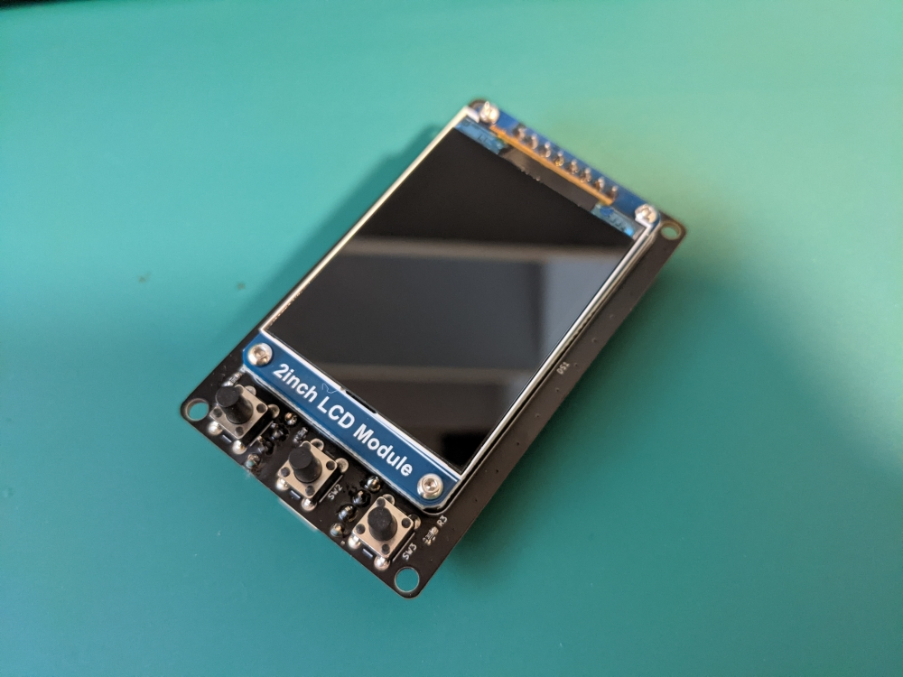
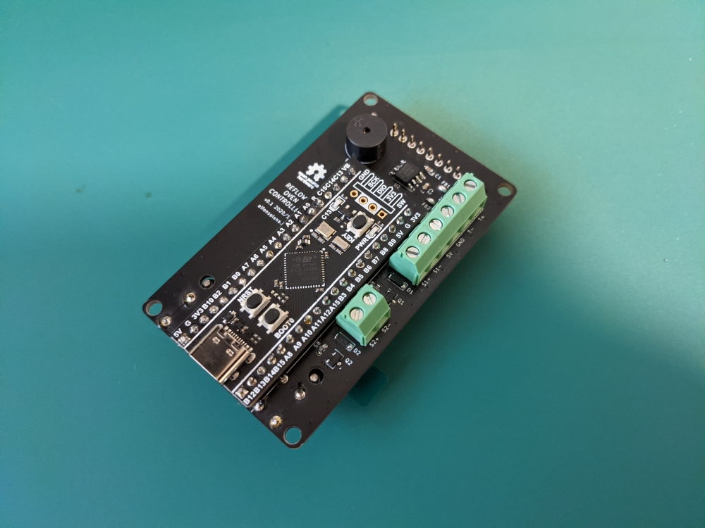

# Reflow Controller

Open-source reflow controller for ovens and hot plates.

 | 
:---: | :---:
Front | Back

## Features

* MCU: STM32F411CEU6 (WeAct MiniF4 "Black Pill" module).
* Sensors: K-Type thermocouple to digital converter. Compatible with both MAX31855 and MAX6675. MAX31855 is recommended.
* Display: 2" 240×320 IPS ST7789 (Waveshare 17344 module).
* Inputs: 3x Push buttons to navigate the menu.
* Outputs: 2x 5V 2A outputs capable of driving solid state relays as well as inductive loads (mechanical relays, fans).
* Buzzer: Alarm buzzer.
* Power: 5V provided via USB-C or screw terminals.

## Where to get

Feel free to build one yourself! The components are easy to source and assemble by hand.

* [Gerbers](https://github.com/AlfonsoJLuna/reflow-controller/tree/master/v0.1/Hardware/Gerbers)
* [Schematics](https://raw.githubusercontent.com/AlfonsoJLuna/reflow-controller/master/v0.1/Hardware/reflow-oven.pdf)
* [Interactive BOM](http://htmlpreview.github.io/?https://raw.githubusercontent.com/AlfonsoJLuna/reflow-controller/master/v0.1/Hardware/ibom.html)

## How to use

### Configuration

* Edit configurable parameters in `Configuration.h` if needed.
* Edit the profiles in `Profile.cpp` if needed. You can also add extra profiles.

### How to build and flash

1. Install STM32CubeProgrammer and the Arduino IDE.
2. From the Boards Manager, install `STM32 Cores 1.9.0` or later, following [this tutorial](https://github.com/stm32duino/wiki/wiki/Getting-Started).
3. Select Board: `Generic STM32F4 series`.
4. Select Board part number: `BlackPill F411CE`.
5. Select USB support: `CDC (generic 'Serial' supersede U(S)ART)`.
6. Select Upload method: `STM32CubeProgrammer (DFU)`.
7. From the Library Manager, install:
    * `Adafruit BusIO 1.7.2`
    * `Adafruit GFX Library 1.10.4`
    * `Adafruit MAX31855 library 1.2.1`
    * `Adafruit ST7735 and ST7789 Library 1.6.0`
8. Reset the board in DFU mode: hold BOOT0, hold NRST, release NRST, release BOOT0. `STM32 BOOTLOADER` should appear in Windows Device Manager.
9. Press the `Upload` button in the Arduino IDE.
