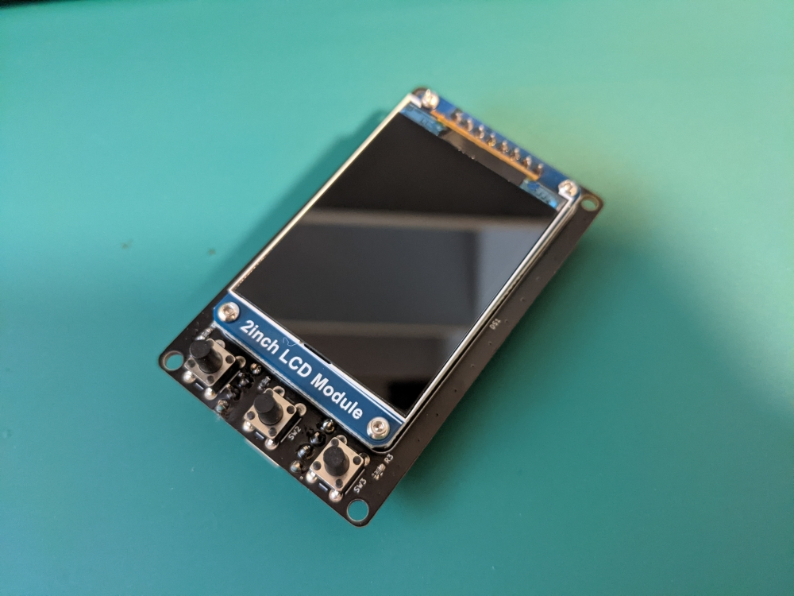
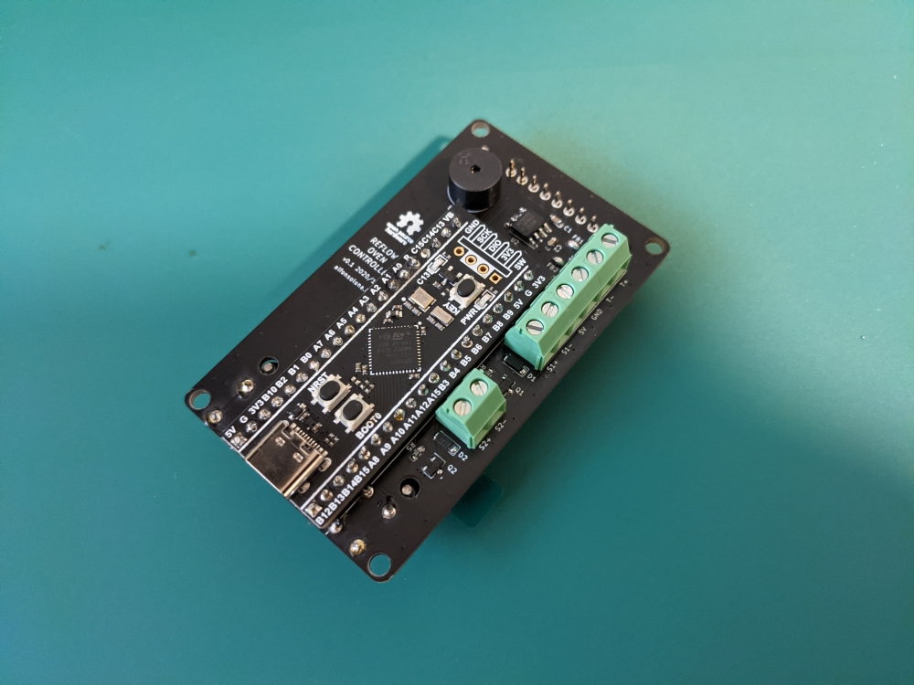

# reflow-oven

Open-source controller for home-made reflow ovens.

 | 
:---: | :---:
Front | Back

## About the hardware

Feel free to build one yourself! The components have been carefully chosen to be easy to source and assemble by hand.

* [Gerbers](https://github.com/AlfonsoJLuna/reflow-oven/tree/master/Hardware/v0.1/Gerbers)
* [Schematics](https://raw.githubusercontent.com/AlfonsoJLuna/reflow-oven/master/Hardware/v0.1/reflow-oven.pdf)
* [Interactive BOM](http://htmlpreview.github.io/?https://raw.githubusercontent.com/AlfonsoJLuna/reflow-oven/master/Hardware/v0.1/ibom.html)

## About the firmware

### How to build/flash

1. Install STM32CubeProgrammer and the Arduino IDE.
2. From the Boards Manager, install `STM32 Cores 1.9.0` or later, following [this tutorial](https://github.com/stm32duino/wiki/wiki/Getting-Started).
3. Select Board: `Generic STM32F4 series`.
4. Select Board part number: `BlackPill F411CE`.
5. Select USB support: `CDC (generic 'Serial' supersede U(S)ART)`.
6. Select Upload method: `STM32CubeProgrammer (DFU)`.
7. From the Library Manager, install:
    * `Adafruit BusIO 1.7.2`
    * `Adafruit GFX Library 1.10.4`
    * `Adafruit MAX31855 library 1.2.1`
    * `Adafruit ST7735 and ST7789 Library 1.6.0`
8. Reset the board in DFU mode: hold BOOT0, hold NRST, release NRST, release BOOT0. `STM32 BOOTLOADER` should appear in Windows Device Manager.
9. Press the `Upload` button in the Arduino IDE.

### To do

* PID controlled outputs with configurable parameters.
* Configurable temperature offset.
* Buzzer should beep when the door needs to be open.
* Retrieve profile names for the menu.
* Proper temperature/time values for the profiles.
