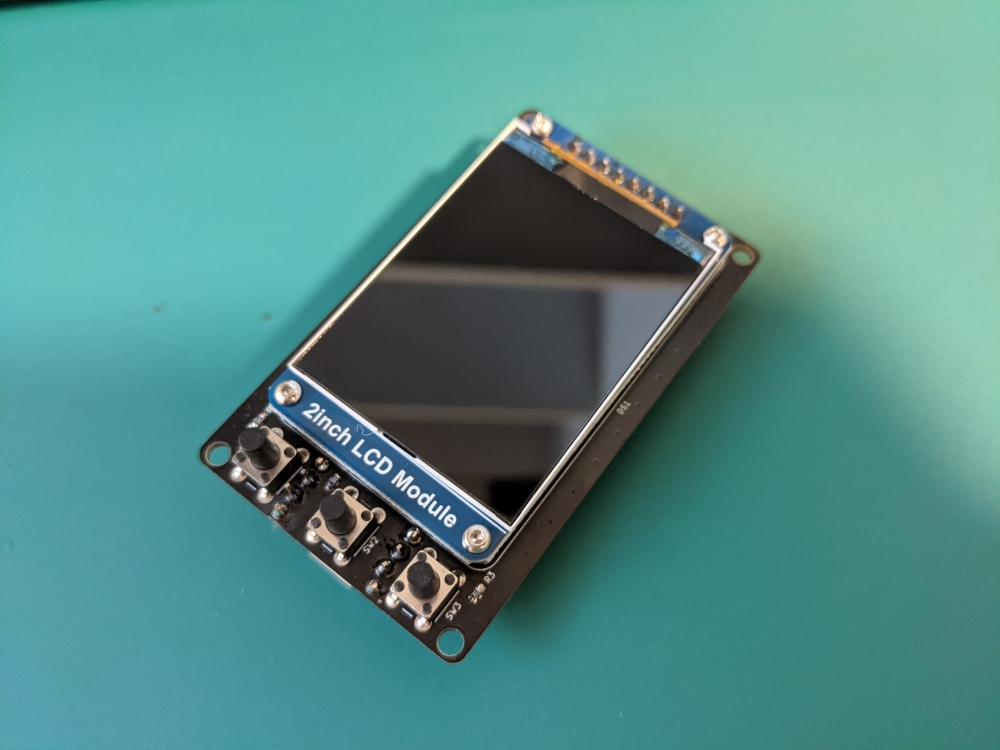
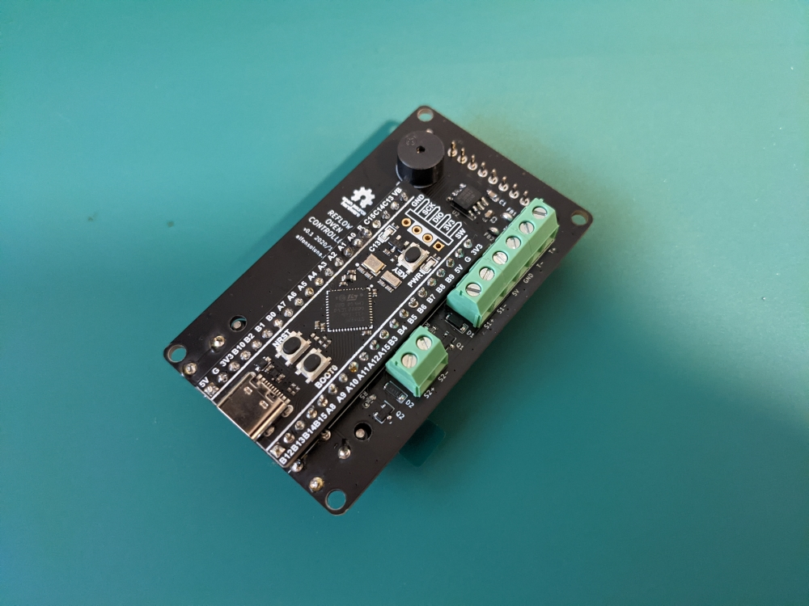

# Reflow Controller

Open-source reflow controller for ovens and hot plates.

 | 
:---: | :---:
Front | Back

## Features

* MCU: STM32F411CEU6 (WeAct MiniF4 "Black Pill" module).
* Sensors: K-Type thermocouple to digital converter. Compatible with both MAX31855 and MAX6675.
* Display: 2" 240×320 IPS ST7789 (Waveshare 17344 module).
* Inputs: 3x Push buttons to navigate the menu.
* Outputs: 2x 5V 2A outputs capable of driving solid state relays as well as inductive loads (mechanical relays, fans).
* Buzzer: Alarm buzzer.
* Power: 5V provided via USB-C or screw terminals.

## Where to get

Feel free to build one yourself! The components are easy to source and assemble by hand.

* [Gerbers](https://github.com/AlfonsoJLuna/reflow-controller/tree/master/v0.1/Hardware/Gerbers)
* [Schematics](https://raw.githubusercontent.com/AlfonsoJLuna/reflow-controller/master/v0.1/Hardware/reflow-oven.pdf)
* [Interactive BOM](http://htmlpreview.github.io/?https://raw.githubusercontent.com/AlfonsoJLuna/reflow-controller/master/v0.1/Hardware/ibom.html)

## Related repositories

Firmware for this board lives in [reflow-controller-fw](https://github.com/AlfonsoJLuna/reflow-controller-fw).

| Hardware version | Compatible firmware |
|---|---|
| v0.1 | [v0.1.0](https://github.com/AlfonsoJLuna/reflow-controller-fw/tree/v0.1.0) |
| v0.2 | FW under development |