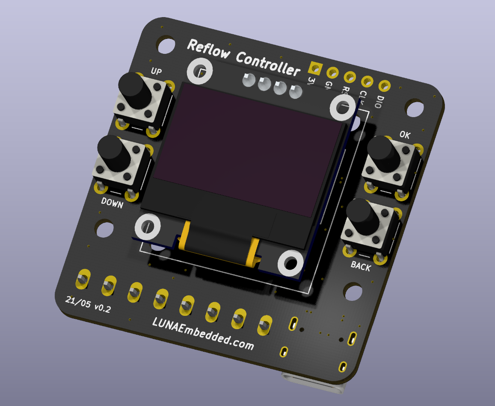
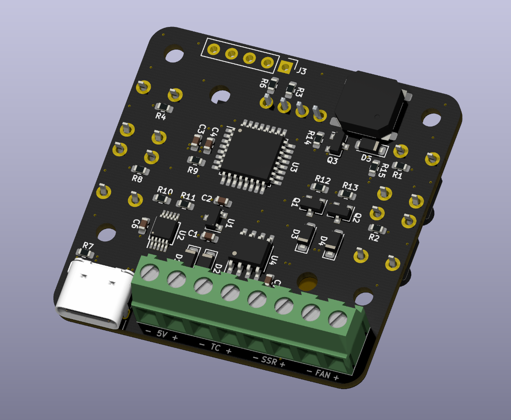

# Reflow Controller

Open-source reflow controller for ovens and hot plates.

 | 
:---: | :---:
Front | Back

## Features

* MCU: STM32G030K6T6
* CH340E USB-Serial converter.
* Sensors: K-Type thermocouple to digital converter. Compatible with both MAX31855 and MAX6675.
* Display: SSD1306 128×164 0.96" OLED.
* Inputs: 4x Push buttons to navigate the menu.
* Outputs: 2x 5V 300mA outputs. Capable of driving solid state relays as well as inductive loads (mechanical relays, fans).
* Buzzer: Alarm buzzer.
* Power: 5V provided via USB-C or screw terminals.

## Related repositories

Firmware for this project lives in [reflow-controller-fw](https://github.com/AlfonsoJLuna/reflow-controller-fw).
